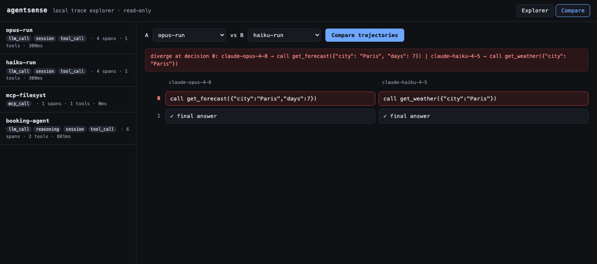
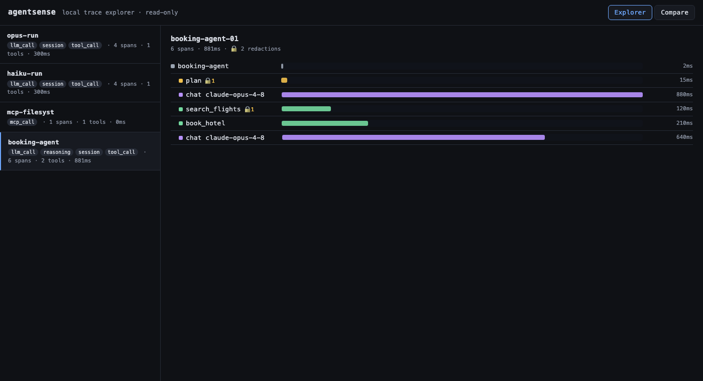

# agentsense

**Make sense of what your AI agents did.** A local-first, MCP-native observability &
debugging tool: a transparent MCP proxy traces every protocol message with **zero code
change to the agent**, PII is redacted deterministically on the write path, and traces
are stored whole (no field whitelist) in local SQLite — then **replayed and diffed** to
see how a different model would have decided.

*Apache-2.0 · local-first · no cloud signup*



> *Compare view — the same run replayed against two models; the first point where their decisions diverge is highlighted.*

## Aim

Ship an open-source, MCP-native agent observability & debugging tool that combines four
properties no existing tool has together: **local-first**, **MCP-native** (instruments
inside the Model Context Protocol, not wrapped via OpenTelemetry), **true trace replay +
trajectory diff**, and **open source**. The goal is a public release with a working demo
and documented architecture — a debugger for AI agents that runs entirely on your machine.

## Why it's useful

When an AI agent misbehaves — wrong tool, bad decision, runaway cost — you are usually
guessing. agentsense gives you ground truth:

- **Protocol-level tracing with zero code change.** Point the agent's MCP config at the
  proxy and every tool call, input/output, latency, and cost is captured — even for
  agents you can't instrument.
- **"Would a different model fix this?"** Replay a recorded trace against another
  model/prompt, feeding back stored tool results, and diff the trajectory to see exactly
  where behaviour diverges — no live tool calls, no API cost, no side effects.
- **Compliance-ready audit trails.** PII is redacted deterministically *before* it is
  ever stored, and the redaction itself is logged — the audit-trail story for EU AI Act
  enforcement (from August 2026).
- **Local-first.** No cloud signup, fully self-hostable.

## What's here (v0)

| Component | Module | Status |
|---|---|---|
| MCP proxy (stdio, transparent) | `proxy/` | ✅ built first |
| Deterministic PII redaction | `redaction/` | ✅ write-path |
| SQLite trace store (whole objects) | `store/` | ✅ |
| Mocked replay + trajectory diff | `replay/` | ✅ pluggable model client |
| Python capture SDK | `sdk/` | ✅ OTel GenAI conventions |
| Local trace-explorer UI | `ui/` | ✅ read-only, FastAPI |

## Design rules (proven in Phase 0, enforced here)

- Proxy forwards raw bytes **unchanged**; only a *copy* is parsed for tracing.
- Logs go to **stderr / file, never stdout** (stdout is the JSON-RPC channel).
- Trace store preserves **unknown/vendor fields** — whole objects, no whitelist.
- Redaction is **deterministic** (hash-derived tokens) so replay aligns.

## Quick start

```bash
uv sync --group dev

# Point your MCP client's server config at this command instead of the real server.
# The proxy forwards transparently and traces to SQLite.
uv run agentsense proxy --db traces.db -- \
    npx -y @modelcontextprotocol/server-filesystem /tmp
```

## Tests

```bash
uv run pytest            # unit tests run offline; the proxy has no model dependency
uv run ruff check .
```

`test_proxy_transparency.py` is an integration test that drives `server-filesystem`
through the proxy with a real MCP client; it self-skips if `npx` is unavailable.

## UI (local trace explorer)

A read-only web app over the trace store — no build step, no Node. It serves a JSON
API and a single static page (trace list → span tree + timeline + redaction badges).



```bash
uv sync --extra ui
uv run agentsense ui --db traces.db        # opens http://127.0.0.1:8000
```

The **Compare** tab renders the side-by-side trajectory diff: pick two captured traces
and see their decision sequences aligned, with the first point of divergence highlighted.

Endpoints: `GET /api/traces`, `GET /api/traces/{id}/spans`, `GET /api/diff?a=&b=`. The
frontend is plain HTML/JS in `ui/static/` — swappable for React later behind the same API.

## Capture SDK

For agents you *can* instrument, the SDK records reasoning-level detail the proxy can't
see. It writes through the same store — and therefore the same redaction path — as the
proxy, using OpenTelemetry GenAI attribute naming (`gen_ai.*`) for interop.

```python
from agentsense.sdk import Tracer
from agentsense.store import SpanStore

tracer = Tracer(SpanStore("traces.db"))
with tracer.session("booking-agent") as s:
    s.step("plan", reasoning=..., model="claude-opus-4-8")
    s.llm_call("claude-opus-4-8", messages=[...], response={...},
               usage={"input_tokens": 1200, "output_tokens": 80})
    s.tool_call("search_flights", args={...}, result={...}, cost=0.002)
```

Spans form a shallow tree (session → steps). `llm_call` stores the whole conversation
(messages, tools, response) so a captured run can be reconstructed into a replayable
`Recording`. Demo: `uv run python examples/sdk_capture.py`.

## Replay + trajectory diff

Re-drive an agent run against a different model, **injecting recorded tool results**
(the engine cannot call a live tool — the guarantee holds by construction), then diff
the two decision trajectories to find the first point of divergence.

```bash
# Offline, no creds — two scripted "models" over the same recorded results:
uv run python examples/replay_scripted.py
# → diverge at decision 0: haiku-4.5 → call get_weather(...) | opus-4.8 → call get_forecast(...)
```

The model client is **pluggable behind one adapter** (`replay/adapters/`): `ScriptedAdapter`
(offline/tests), `BedrockAdapter` (Converse, dev), `OpenAICompatAdapter` (OSS release). The
engine speaks only provider-neutral types — swapping providers never touches it. Recorded
tool results can be supplied directly or pulled from a captured proxy trace via
`Recording.from_trace_store(...)`.

### Capture → replay (the full loop)

An SDK-captured run replays end-to-end: `Recording.from_sdk_trace(store, trace_id)`
reconstructs the question, tools, model, and recorded tool results, and
`captured_trajectory(store, trace_id)` reconstructs what the agent *actually did*. Diff
the two to answer "would a different model have decided differently than my agent did?"

```bash
uv run python examples/capture_then_replay.py
# → diverge at decision 0: claude-haiku-4-5 → call get_weather(...) | rushed-model → final answer
```

## Model access (live replay only — not needed for the proxy)

Live replay uses AWS Bedrock (Converse API) for dev, OpenAI-compatible for the OSS
release. Before running the Bedrock example:

```bash
aws sso login --profile <your-aws-profile>        # temporary SSO creds
export AWS_PROFILE=<your-aws-profile> AWS_REGION=eu-west-1
uv run --extra replay python examples/replay_bedrock.py
```

## Contributing

Issues and PRs welcome — see [CONTRIBUTING.md](./CONTRIBUTING.md). All tests run offline
(`uv run pytest`); the proxy has no model dependency.

## License

[Apache License 2.0](./LICENSE) — includes an explicit patent grant.
